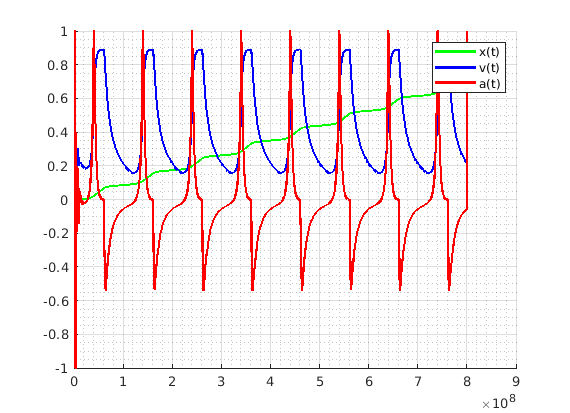
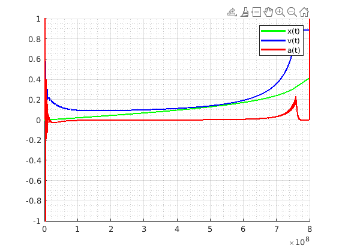

# Тестирование в Matlab

### 1. grapth_tachometr
Подаём на вход тахометру данные, снимаем координату,
скорость и ускорение и строим график. Обмен данными через файлы.

1. Генерируем входные данные для тахометра 
(время импульсов) в функции `writeT()`. Задав
зависимость x(t), самописной функцией (вроде как работает верно)
'модулируем' временные импульсы по частоте. Получаем
эмулированный набор моментов срабатывания
датчика оборотов. Пишем в файл `fstreams/f1_input.txt`. Слабое место - 
максимальный размер периода (в примере 0.1). 
Изменяя его, можно получить качественно другие результаты.

2. Запускаем тест `test_tachometr::graph()` в С++ проекте.
Проводится моделирование по вычитанным из файла данным, 
результаты пишутся в соседний.

3. Вычитываем посчитанные данные тахометра из файла `fstreams/f1_output.txt`
и строим графики **x(t)**, **v(t)**, **a(t)**.

Примеры:

x = sin(2pi*t)

x = 20t^2

